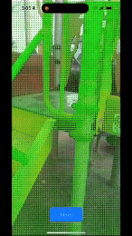

# iOS PCL Test C++ Interoperability

This project demonstrates the integration of the Point Cloud Library (PCL) with iOS for 3D mesh reconstruction.

## Demo

Here is a demonstration of the project in action:

## Included Prebuilt Libraries

The following prebuilt libraries are included in this repository:
- **PCL (Point Cloud Library)**: Built for iOS (static library).  
  Source: [Point Cloud Library (PCL)](https://github.com/PointCloudLibrary/pcl)
- **Boost**: Built using [boost-iosx](https://github.com/faithfracture/boost-iosx) (static library).  
  Source: [Boost C++ Libraries](https://github.com/boostorg/boost)
- **FLANN**: Built for iOS (static library).  
  Source: [FLANN (Fast Library for Approximate Nearest Neighbors)](https://github.com/mariusmuja/flann)
- **Qhull**: Built for iOS (static library).  
  Source: [Qhull](http://www.qhull.org/)
- **LZ4**: Built for iOS (static library).  
  Source: [LZ4](https://github.com/lz4/lz4)
- **Eigen**: Header-only library (included directly in the project).  
  Source: [Eigen](https://gitlab.com/libeigen/eigen)

All prebuilt libraries are distributed in compliance with their respective licenses. See the `licenses` folder for details.

## Building the Project

### Prerequisites
- Xcode 16 or later

## Licensing

This project is licensed under the MIT License. See the [LICENSE](LICENSE) file for details.

Each prebuilt library is subject to its own license. See the `licenses` folder for the full text of each license:
- [PCL (Point Cloud Library)](https://github.com/PointCloudLibrary/pcl) - BSD License
- [Boost](https://github.com/boostorg/boost) - Boost Software License 1.0
- [FLANN](https://github.com/mariusmuja/flann) - BSD License
- [Qhull](http://www.qhull.org/) - BSD-style License
- [LZ4](https://github.com/lz4/lz4) - BSD License
- [Eigen](https://gitlab.com/libeigen/eigen) - MPL2 License
